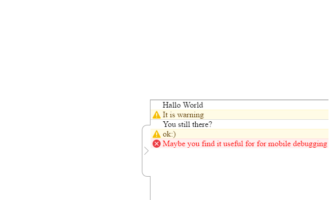

## mobile-console
>Simple console for debugging on mobile device



### Install
**Using npm**
> npm install mobile-console

###Overview


### Usage

Simple html including:
```html
  <script src="./node_modules/mobileConsole/index.min.js" type="text/javascript"></script>
```
```js
  mobileConsole.init();
```

Require style:
```js
var mobileConsole = require('mobile-console');
```

With AMD:
```js
define(['mobile-console'], function(mobileConsole))
```